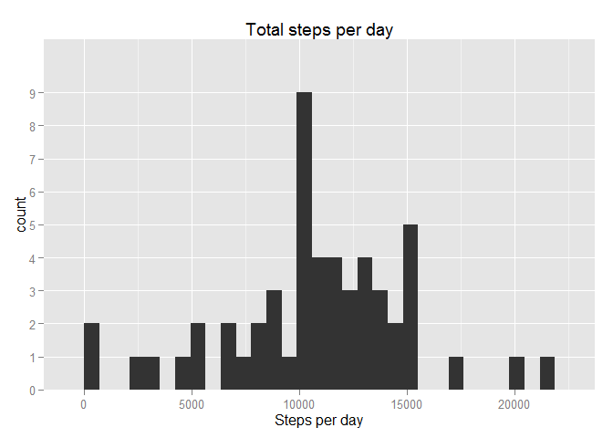
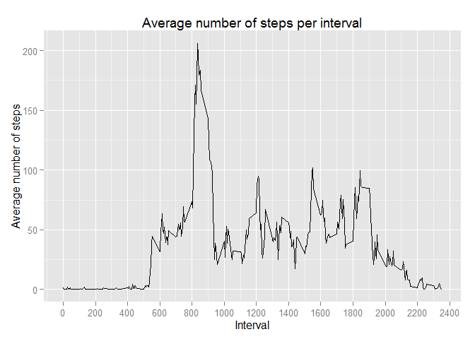
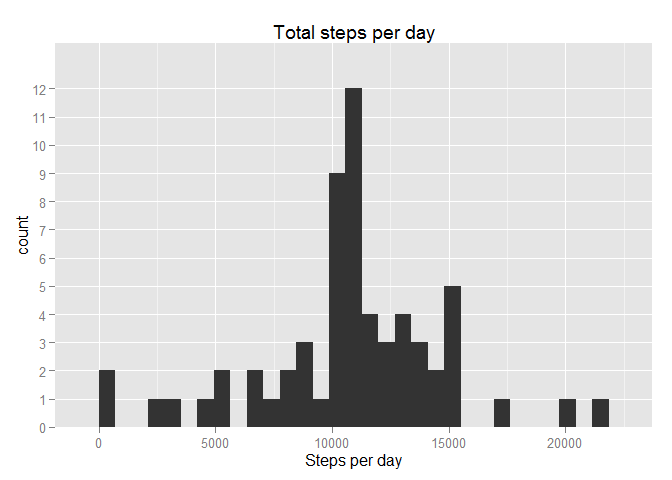
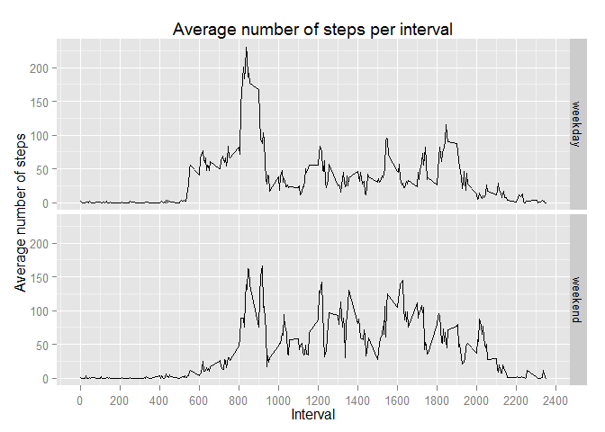

# Reproducible Research: Peer Assessment 1


## Loading and preprocessing the data

```r
# Unzip and load the activity data
unzip("activity.zip")
activityData <- read.csv("activity.csv")

# Change intervals to hours
activityData$Time <- format(activityData$interval/100, nsmall=2)
activityData$Time <- as.character(activityData$interval)
activityData$Time <- gsub("\\.",":",activityData$interval)
```


## What is mean total number of steps taken per day?


```r
# load required packages
library(dplyr)
```

```
## 
## Attaching package: 'dplyr'
## 
## The following object is masked from 'package:stats':
## 
##     filter
## 
## The following objects are masked from 'package:base':
## 
##     intersect, setdiff, setequal, union
```

```r
library(ggplot2)
```


```r
# Calculate total number of steps per day
dailySteps <- activityData %>% group_by(date) %>% 
        summarise(TotalStepsPerDay = sum(steps))

# Plot histogram
g1 <- ggplot(dailySteps, aes(TotalStepsPerDay))
g1 + geom_histogram() +
        labs(x = "Steps per day", title = "Total steps per day") +
        scale_y_discrete()
```

```
## stat_bin: binwidth defaulted to range/30. Use 'binwidth = x' to adjust this.
```

 

```r
# Included this to disable scientific notation of mean
options(scipen=999)

# Calculate mean and median of daily steps
meanDailySteps <- round(mean(dailySteps$TotalStepsPerDay, na.rm = TRUE),1)
medianDailySteps <- median(dailySteps$TotalStepsPerDay, na.rm = TRUE)
```

The mean number of daily steps is 10766.2.  
The median of the daily number of steps is 10765.

## What is the average daily activity pattern?


```r
# Calculate average number of steps per interval
intervalSteps <- activityData %>% group_by(interval) %>% 
        summarise(TotalStepsPerInterval = mean(steps, na.rm = TRUE))

# Plot data
g2 <- ggplot(intervalSteps, aes(interval,TotalStepsPerInterval))
g2 +    geom_line() +
        scale_x_continuous(breaks=seq(0,2400,by = 200)) +
        labs(x = "Interval", y = "Average number of steps") +
        labs(title = "Average number of steps per interval")
```

 

```r
# Calculate time interval with max. averagenumber of steps
maxAverage<-max(intervalSteps$TotalStepsPerInterval)
maxInterval <- which(intervalSteps$TotalStepsPerInterval == maxAverage)
maxTime <- maxInterval*5/60
maxHours <- floor(maxTime)
maxMins <- (maxTime - maxHours)*60
```

The interval with the maximum average number of steps is 8:40h - 8:45h.


## Imputing missing values


```r
# Calculate number of NAs in dataset
dataNAs <- sum(is.na(activityData))
```

The total number of NAs in the dataset is 2304.


```r
# Construct vector of mean values for interval to fill NAs in
fillData <-rep(intervalSteps$TotalStepsPerInterval, times = 61)

activityData2<-activityData

# Replace NAs with mean values

for (i in 1:length(activityData2$steps)){
        
        if (is.na(activityData2[i,1])){
                activityData2[i,1] <- fillData[i]
        }
}

# Calculate total number of steps per day
dailySteps2 <- activityData2 %>% group_by(date) %>% 
        summarise(TotalStepsPerDay = sum(steps))

# Plot histogram
g3 <- ggplot(dailySteps2, aes(TotalStepsPerDay))
g3 + geom_histogram() +
        labs(x = "Steps per day", title = "Total steps per day") +
        scale_y_discrete()
```

```
## stat_bin: binwidth defaulted to range/30. Use 'binwidth = x' to adjust this.
```

 

```r
# Calculate mean and median of daily steps
meanDailySteps2 <- round(mean(dailySteps2$TotalStepsPerDay, na.rm = TRUE),1)
medianDailySteps2 <- round(median(dailySteps2$TotalStepsPerDay, na.rm = TRUE))
```

The mean number of daily steps is now 10766.2 (was 10766.2).  
The median of the daily number of steps is now 10766 (was 10765).

The mean number of steps has not changed, since all NAs have been replaced with mean values.
The median number of steps has slightly changed, but not significantly.

## Are there differences in activity patterns between weekdays and weekends?


```r
# Create vector of week/weekend days (in Dutch)
days <- weekdays(as.Date(activityData2$date))
dayType <- c()
for (i in 1:length(days)){
        if(days[i]=="zaterdag" || days[i]=="zondag"){
                dayType[i]<-"weekend"
        } else {
                dayType[i]<-"weekday"
        }
}
dayType <- as.factor(dayType)

activityData4<-cbind(activityData2,dayType)

# Calculate average number of steps per weekday/weekendday
weekSteps <- activityData4 %>% group_by(dayType,interval) %>% 
        summarise(TotalStepsPerInterval = mean(steps))

# Plot data
g4 <- ggplot(weekSteps, aes(interval,TotalStepsPerInterval))
g4 +    geom_line() +
        facet_grid(dayType ~ .) +
        scale_x_continuous(breaks=seq(0,2400,by = 200)) +
        labs(x = "Interval", y = "Average number of steps") +
        labs(title = "Average number of steps per interval")
```

 

A difference in activity pattern between weekdays and weekend days can clearly be seen. On weekdays, there is a peak around 8:00 in the morning, while during the weekend the activity is more spread out over the day.
